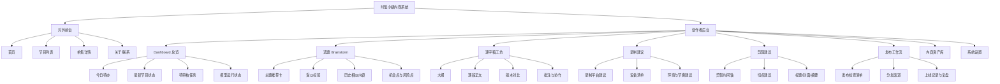

# 时髦小姨创作者后台 页面原型结构 & 信息架构

## 1. 设计目标

这个后台不是“播客管理台”的弱化版，而是面向主播运营的内容生产控制台。页面设计要围绕四个高频动作展开：选题、写稿、录制、剪辑、发布。

## 2. 双层站点结构

建议保留两层：

- 对外前台：品牌展示、节目列表、单集详情、播放入口。
- 对内后台：内容分析、选题生成、逐字稿、录制建议、剪辑建议、发布工作流。

前台负责承接流量与收听，后台负责承接内容生产。

## 3. 首页与后台信息架构图



## 4. 页面原型结构

### 4.1 Dashboard 总览

首屏应包含：

- 今日待办：待写稿、待审核、待剪辑、待发布。
- 最新节目：最新 RSS 同步结果与状态。
- 模型摘要：最近一次 GLM 分析的主题、情绪与建议。
- 风险提示：缺少转写、素材未齐、发布未完成。

关键交互：

- 点击卡片直接进入对应任务页。
- 支持“重新生成选题”与“同步 RSS”。
- 支持一键切换周视图 / 月视图。

### 4.2 选题 Brainstorm

页面分三栏最稳妥：

- 左栏：节目来源与过滤条件。
- 中栏：选题卡片列表。
- 右栏：选中主题的解释、相似内容、适合人群、风险点。

每个选题卡建议显示：

- 主题标题。
- 推荐理由。
- 热度/新颖度/可讲述性评分。
- 相似历史节目。
- 一键生成逐字稿。

### 4.3 逐字稿工坊

页面结构建议为：

- 顶部：选题标题、版本、状态、导出按钮。
- 左栏：逐字稿大纲与段落导航。
- 中栏：正文编辑区。
- 右栏：模型建议、金句、转场、口语化优化建议。

适合支持的交互：

- 逐段重写。
- 语气切换：更口语 / 更专业 / 更松弛。
- 版本对比。
- 将某一段标记为“必须保留”。

### 4.4 录制建议

核心输出不是长文，而是操作清单。

- 录制平台建议。
- 麦克风/耳机/环境建议。
- 录制节奏建议。
- 开场提醒与注意事项。
- 录制前 checklist。

### 4.5 剪辑建议

页面应尽量结构化。

- 自动生成章节点。
- 每个章节点附推荐切点。
- 输出可直接给剪辑师的备注。
- 自动生成标题、封面文案、简介摘要。

### 4.6 发布工作流

建议把发布页设计成状态机。

- 待确认脚本。
- 待录制。
- 待剪辑。
- 待审核。
- 待发布。
- 已发布。

每个状态都应能看到：责任人、截止时间、缺失项、历史版本与复盘备注。

### 4.7 内容资产库

内容资产库用于沉淀可复用素材。

- 历史节目。
- 主题簇。
- 语义标签。
- 封面与标题资产。
- 录制/剪辑最佳实践。

## 5. 建议目录结构

如果后续直接开实现，建议按“前台 + 后台 + 数据服务”分层：

```text
shimai-creator-studio/
  app/
    (public)/
      page.tsx
      episodes/
      episode/[id]/
      about/
    (studio)/
      dashboard/
      brainstorm/
      scripts/
      recording/
      editing/
      publish/
      assets/
      settings/
  components/
    studio/
    public/
    charts/
    editor/
  lib/
    rss/
    glm/
    analytics/
    workflow/
  server/
    api/
    jobs/
    models/
  data/
    seeds/
    mocks/
  tests/
    unit/
    integration/
```

## 6. 页面到能力映射

| 页面 | 主要能力 | 主要输入 | 主要输出 |
|---|---|---|---|
| Dashboard | 汇总与提醒 | RSS 同步结果、任务状态、模型运行 | 今日待办、风险提示 |
| Brainstorm | 主题推荐 | 历史节目、RSS、标签 | 选题候选、评分、解释 |
| Scripts | 逐字稿生成 | 选题、提纲、历史口吻 | 逐字稿、版本、批注 |
| Recording | 录制建议 | 脚本、平台偏好 | 录制 checklist、平台建议 |
| Editing | 剪辑建议 | 音频、逐字稿、节奏标签 | 时间轴、切点、标题 |
| Publish | 发布编排 | 脚本、剪辑产物、渠道规则 | 发布清单、状态、复盘 |

## 7. 交互原则

- 先给结论，再给证据。
- 默认展示“可执行建议”，不要一上来塞原始模型日志。
- 所有 AI 输出都要允许人工改写。
- 页面上的每个建议都要能追溯到来源与版本。
- 运营常用动作要放在右上角或首屏可见区域。

## 8. 视觉方向建议

整体风格建议是“专业、克制、可编辑”，而不是娱乐化或播客平台风。

- 首页偏总览感，强调任务与状态。
- Brainstorm 页偏分析感，强调主题簇与解释。
- Scripts 页偏编辑器感，强调写作与版本。
- Publish 页偏流程感，强调任务流与审核。

如果你要继续往实现走，我建议先做这 4 个页面：Dashboard、Brainstorm、Scripts、Publish。它们能最早验证 RSS + GLM 的价值闭环。